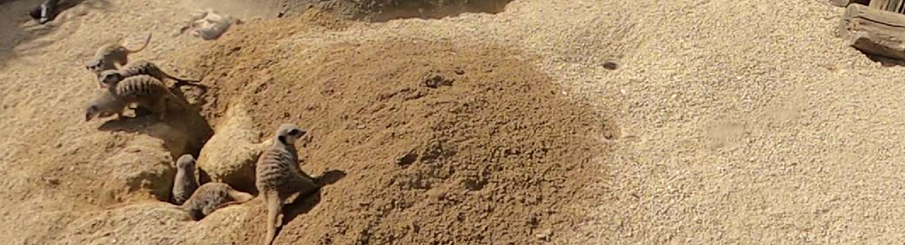
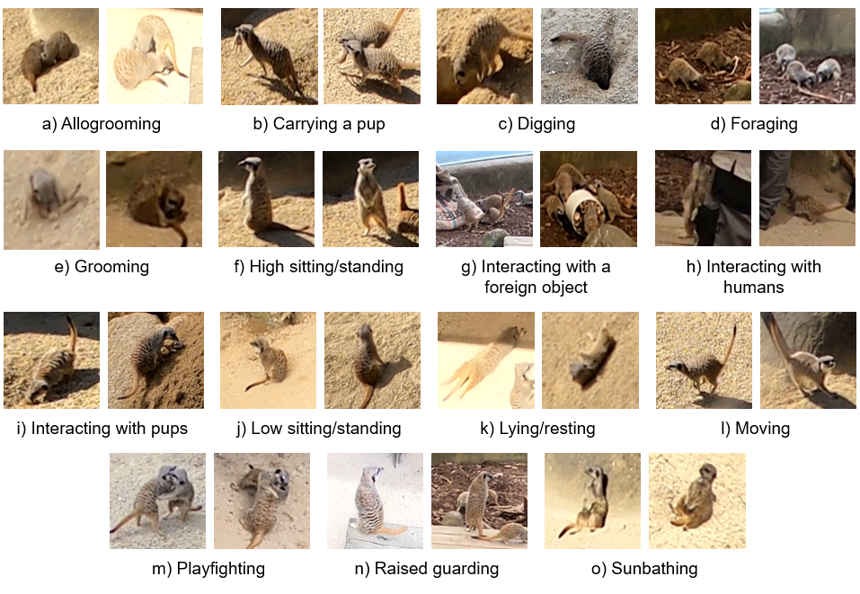

This is the official repository for the **Meerkat Behaviour Recognition Dataset** presented as a poster at the CVPR 2023 Workshop CV4Animals.<br/>
**Authors:** Mitchell Rogers, Gaël Gendron, David Arturo Soriano Valdez, Mihailo Azhar, Yang Chen, Shahrokh Heidari, Caleb Perelini, Padriac O’Leary, Kobe Knowles, Izak Tait, Simon Eyre, Michael Witbrock, Patrice Delmas.<br/>
**Supported by:** *Natural, Artificial, and Organisation Intelligence Institute, The University of Auckland, New Zealand*


## Abstract
Recording animal behaviour is an important step in evaluating the well-being of animals and further understanding the natural world. Current methods for documenting animal behaviour within a zoo setting, such as scan sampling, require excessive human effort, are unfit for around-the-clock monitoring, and may produce human-biased results. Several animal datasets already exist that focus predominantly on wildlife interactions, with some extending to action or behaviour recognition. However, there is limited data in a zoo setting or data focusing on the group behaviours of social animals. We introduce a large meerkat (*Suricata Suricatta*) behaviour recognition video dataset with diverse annotated behaviours, including group social interactions, tracking of individuals within the camera view, skewed class distribution, and varying illumination conditions. This dataset includes videos from two positions within the meerkat enclosure at the Wellington Zoo (Wellington, New Zealand), with 848,400 annotated frames across 20 videos and 15 unannotated videos.

## Poster


## Example behaviours of interest

| **Interactions with pups**        | **Playfighting** |
| <video id="pupsVid" autoplay muted loop width="250"><source src="images/Meerkat_pup.webm" type="video/mp4"></video> | <video id="playfightVid" autoplay muted loop width="250"><source src="images/Meerkats_social.webm" type="video/mp4"></video> |
| *A meerkat brings a pup over to other meerkats digging, they stop what they are doing to interact with the pup before being alerted to danger and running away.* | *A few meerkats playfight and groom each other.* |

## Behavioural ethogram
The meerkats in each frame were labelled as one of 15 behaviours described in the behavioural ethogram:



| __Behaviour__                     | __Number of frames(%)__ |
| :-------------------------------- | :---------------------- |
| Foraging                          | 1,202,101 (28.72%)      |
| Raised Guarding                   | 588,305 (14.06%)        |
| Moving                            | 567,835 (13.57%)        |
| Low sitting/standing              | 469,214 (11.21%)        |
| Digging                           | 423,183 (10.22%)        |
| High sitting/standing             | 318,665 (7.61%)         |
| Lying/resting                     | 142,980 (3.42%)         |
| Interacting with a pup            | 138,730 (3.32%)         |
| Interacting with a foreign object | 113,504 (2.71%)         |
| Sunbathing                        | 73,748 (1.76%)          |
| Playfighting                      | 49,847 (1.19%)          |
| Grooming                          | 37,324 (0.89%)          |
| Carrying a pup                    | 35,417 (0.85%)          |
| Allogrooming                      | 20,822 (0.50%)          |
| Interacting with humans           | 3,191 (0.08%)           |
| __Total__                         | 4,184,866               |

The total number of frames for each behaviour of interest, with a percentage of total frames.

*For more information, and the description of each behaviour see the arXiv publication.*


## Annotation format

Each row of the annotation file contains the following information:
`Frame number, object type, object ID, behaviour index, occluded, x1, x2, y1, y2`

**Object type:** 0 if the observation is a Meerkat, 1 if it is a pup (the approximate position of the pups was recorded, but they will probably be too small to detect).
**Object ID:** This is the ID assigned to each individual. If the individual remains between frames, the ID will be present again at that frame number. The ID does not persist between videos.
**Behaviour index:** Corresponds to the behaviour in the JSON file.
**Occluded:** 1 if the observation is occluded.
**x1, x2, y1, y2:** The pixel locations of the two corners of the bounding box.

# Dataset and publication links
* <a href="https://arxiv.org/abs/2306.11326">arXiv publication</a>
* <a href="https://doi.org/10.17608/k6.auckland.23538261.v1">Videos</a>
* [Annotations](Annotations.zip)

## Citation
To cite this dataset please use the following reference.

```BibTeX
@misc{rogers2023meerkat,
      title={Meerkat Behaviour Recognition Dataset}, 
      author={Mitchell Rogers and Gaël Gendron and David Arturo Soriano Valdez and Mihailo Azhar and Yang Chen and Shahrokh Heidari and Caleb Perelini and Padriac O'Leary and Kobe Knowles and Izak Tait and Simon Eyre and Michael Witbrock and Patrice Delmas},
      year={2023},
      eprint={2306.11326},
      archivePrefix={arXiv},
      primaryClass={cs.CV}
}
```

## Acknowledgements

This project is supported by the <a href="https://www.auckland.ac.nz/en/science/our-research/research-institutes-and-centres/nao-institute/about-naoinstitute.html">Natural, Artificial, and Organisation Intelligence Institute (NAOInstitute)</a>.

We would like to thank <a href="https://wellingtonzoo.com/">Wellington Zoo</a> for their support and expertise provided throughout the project.
