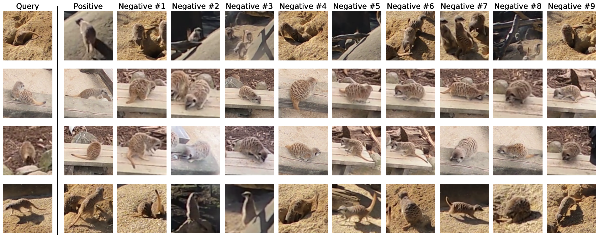

This is the repository for the **Meerkat Re-identification Dataset** used in the paper **Recurrence over Video Frames (RoVF) for the Re-identification of Meerkats** presented as a poster at the CVPR 2024 Workshop CV4Animals, and the paper **Recurrence over Video Frames (RoVF) for Animal Re-identification** under consideration for publication.<br/>

## Poster


## Dataset
This dataset repurposes the [Meerkat Behaviour Recognition Dataset](https://arxiv.org/abs/2306.11326) for video-based meerkat re-identification using clips extracted from the annotated tracks. No IDs are provided for individuals, but by using co-occurrences of individuals, we use this dataset to match individuals.

We are looking for options to host the dataset, for now we will use DropBox due to the folder size. If there are problems accessing this dataset please contact Mitchell Rogers ([mrog173@aucklanduni.ac.nz](mailto:mrog173@aucklanduni.ac.nz)).
[Re-identification Dataset DropBox](https://www.dropbox.com/scl/fo/xzsp6lvgnfps8czmdea1c/APpXIOFpERusutHeZ6HzhPY?rlkey=1zc6gq08gre6icl8ddpms9dyv&st=4dzy8kpt&dl=0)

*For more information, see the related publications.*

# Dataset and publication links
* [arXiv workshop publication](https://arxiv.org/abs/2406.13002)
* [RoVF for animals publication - coming soon]()
* [Behaviour dataset](https://arxiv.org/abs/2306.11326)
* [Code repository](https://github.com/KobeKnowles/RoVF-meerkat-reidentification)
* [Annotations](Annotations.zip)

## Citation
To cite this dataset please use the following reference.

```BibTeX
@misc{rogers2024recurrencevideoframesrovf,
      title={Recurrence over Video Frames (RoVF) for the Re-identification of Meerkats}, 
      author={Mitchell Rogers and Kobe Knowles and Gaël Gendron and Shahrokh Heidari and David Arturo Soriano Valdez and Mihailo Azhar and Padriac O'Leary and Simon Eyre and Michael Witbrock and Patrice Delmas},
      year={2024},
      eprint={2406.13002},
      archivePrefix={arXiv},
      primaryClass={cs.CV},
      url={https://arxiv.org/abs/2406.13002}, 
}
```

## Acknowledgements

This project is supported by the <a href="https://www.auckland.ac.nz/en/science/our-research/research-institutes-and-centres/nao-institute/about-naoinstitute.html">Natural, Artificial, and Organisation Intelligence Institute (NAOInstitute)</a>.

We would like to thank <a href="https://wellingtonzoo.com/">Wellington Zoo</a> for their support and expertise provided throughout the project.
